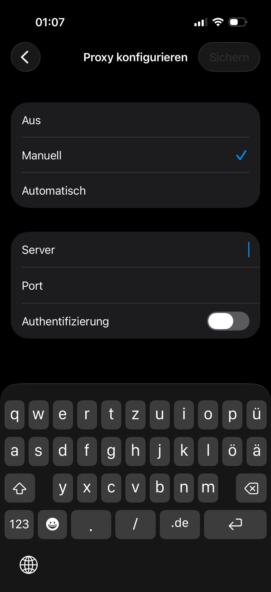

# Vibes (Serlo) — Roadmap

> Letztes Update: April 2026

---

## ✅ Phase 1 — Foundation (abgeschlossen)

- [x] Feed (personalisierter Algorithmus, Explore, Tags)
- [x] Post erstellen (Video + Bilder, Trimming, Thumbnail-Upload)
- [x] Profile (eigenes + fremdes Profil, Grid, Follow/Unfollow)
- [x] Kommentare (Threads, Replies, Realtime)
- [x] Likes, Bookmarks, Reposts
- [x] Direktnachrichten (DM mit Realtime)
- [x] Notifications (Push + In-App)
- [x] Live Streaming (LiveKit, Host + Viewer, Geschenke, Reaktionen)
- [x] Stories (Erstellen, Ansehen, Polls, Reply via DM)
- [x] Guilds (Communities, Guild-Feed, Leaderboard)
- [x] Hashtag-Navigation (klickbar im Feed und Post-Detail)
- [x] User blockieren / melden
- [x] Einstellungen (Account, Datenschutz, Löschen)
- [x] Apple Sign-In
- [x] Onboarding Flow

---

## 🚀 Phase 2 — iOS Launch (aktuell)

- [x] Performance-Optimierungen (Thumbnail-Preview, N+1-Fix, JOIN-Queries)
- [x] Glassmorphism UI (Live Start Screen)
- [x] Persistenter React Query Cache (Feed überlebt Kaltstarts)
- [x] `cachePolicy="memory-disk"` auf allen Feed-Bildern
- [x] Virtuelle Geschenke (Supabase Schema, Gift Catalog, Coins, Realtime-Hook, Animated UI)
- [x] AR Kamera v2 — Skia Frame Processor (ColorMatrix Color-Filter, 22 Filter)
- [x] AR Kamera v3 — Live Face-Tracking Sticker, Vignette, Rainbow-Frame, Bug-Fixes
- [x] Deep Bug-Fix: Storage-Leak, Race-Condition, stale-closure, RefObject-Typ
- [x] Open-Source Audit (Skia, ML Kit, VisionCamera, Reanimated, Moti, Haptics)
- [x] **AR Kamera Upgrade** ✅
  - [x] Phase 1: Haptic Feedback auf Shutter + Filter-Wechsel
  - [x] Phase 2: Reanimated Migration (LiveStickerOverlay von legacy Animated)
  - [x] Phase 3: GPU Shader Filter (Film Grain, Chromatic Aberration, Halftone, Glitch)
  - [x] Phase 4: Skia Skottie — animierte Lottie-Sticker statt Emoji-Text
  - [x] Phase 5: `moti` aus package.json entfernen (totes Paket)
- [x] SQL-Migration in Supabase ausgeführt:
  - [x] `20260405040000_thumbnail_url_in_feed.sql` → ✅ Success
  - [x] `20260407_virtual_gifts.sql` → ✅ bereits vorhanden (idempotent)
  - [x] `verify_functions.sql` → ✅ Daten gesund (Max Score 4.24, 24 Gaming-Logs)
- [x] **EAS Production Build iOS v1.6.0** → ✅ Build #199 eingereicht (07.04.2026)

### 💰 Monetarisierung — Borz Coins IAP ✅ (09.04.2026)
- [x] RevenueCat SDK integriert (`react-native-purchases`)
- [x] RevenueCat Projekt konfiguriert (App Store Connect .p8 Key verknüpft)
- [x] 4 Consumable IAP Produkte in App Store Connect erstellt:
  - `com.vibesapp.vibes.coins_100` → 100 Borz Coins — 0,99€
  - `com.vibesapp.vibes.coins_500` → 500 Borz Coins — 3,99€
  - `com.vibesapp.vibes.coins_1200` → 1200 Borz Coins — 8,99€
  - `com.vibesapp.vibes.coins_3000` → 3000 Borz Coins — 19,99€
- [x] RevenueCat Offerings konfiguriert (`default` Offering mit 4 Packages)
- [x] Borz Coin Icon erstellt (Wolf-Münze, Gold, Premium Design)
- [x] **Coin Shop UI** — TikTok-inspirierter Shop (Grid, Selected State, Payment Methods)
- [x] Navigation zu Coin Shop (aus Profil + aus Gift-Panel im Livestream)
- [x] Supabase `coin_purchases` Tabelle (Idempotenz-Log für Käufe)
- [x] `credit_coins` RPC (atomare UPSERT-Funktion für Wallet-Gutschrift)
- [x] **RevenueCat Webhook** deployed (`revenuecat-webhook` Edge Function)
  - RevenueCat → Supabase → `coins_wallets` automatisch nach Kauf
  - Webhook "Serlo Coin Credits" → Active in RevenueCat
- [x] Bundle ID auf `com.vibesapp.vibes` korrigiert (war fälschlicherweise `com.serloapp.serlo`)
- [x] **EAS Build v1.8.0** (Build #203) gestartet — mit Borz Coin + Coin Shop

### 📋 Noch offen für v1.8.0:
- [ ] IAPs zur App-Version in App Store Connect hinzufügen
- [ ] App Store Review einreichen
- [ ] Bankverbindung in App Store Connect eintragen (für Auszahlungen)
- [ ] TestFlight Beta für erste Nutzer

### ✅ Branding-Fixes (11.04.2026)
- [x] `"Vibes v..."` → `"Serlo v..."` in settings.tsx
- [x] Privacy-URLs von `vibes-web-nine.vercel.app` → `serlo.social/privacy`
- [x] Login-Screen Logo: `vibes` → `Serlo`
- [x] Onboarding Welcome-Screen: `vibes` → `Serlo`  
- [x] Kamera Top-Bar + Permission-Screen: `vibes`/`Vibes` → `Serlo`
- [x] Feed-Screen: `"Willkommen bei Vibes"` → `"Willkommen bei Serlo"`
- [x] Profil-Stats: `"Vibes"` → `"Posts"` (ProfileListHeader + UserProfileContent)
- [x] Messages: Post-Badge `"Vibes"` → `"Serlo"`

---

## 📱 Phase 3 — Post-Launch Mobile (Q3 2026)

- [ ] Android Support (EAS Build)
- [x] Duett / Stitch Feature (wie TikTok) → ✅ **Live-Duet fertig** (v1.15.2)
- [x] Sound-/Musik-Bibliothek für Videos → ✅ **fertig**
  - [x] `lib/useMusicPicker.ts` — 8 royaltyfreie Tracks + `useAudioPlayer` Hook
  - [x] `components/camera/MusicPickerSheet.tsx` — TikTok-Style Bottom Sheet
  - [x] Genre-Filter, SVG-Waveform-Visualizer, Play/Pause Preview
  - [x] Sound-Pill in Camera wird aktiv wenn Track ausgewählt
  - [x] **Lautstärke-Slider** — PanResponder-basiert, jitterfrei, Creator bestimmt Lautstärke
  - [x] **audio_volume in DB** — `posts` Tabelle + `get_vibe_feed` RPC updated (Migration ausführen!)
  - [x] **Feed respektiert Lautstärke** — `FeedItem` liest `audio_volume` aus DB, setzt `expo-av`-Volume
  - [x] **Mute-Button für Musik-Posts** — erscheint auch bei Bild-Posts mit Track, steuert expo-av live
  - [x] **Musik im Post-Detail** — `post/[id].tsx` lädt + spielt `audio_url`/`audio_volume`, Mute-Button, Musik-Badge
- [x] **Immersiver Create-Screen** → ✅ **fertig** (TikTok-Style)
  - [x] Vollbild-Medienvorschau als Hintergrund
  - [x] Rechte Tool-Sidebar — Sound, Text, Sticker (bald), Filter (bald), Drehen (bald)
  - [x] Top-Bar: Zurück, Musik-Badge (mit X), Einstellungsrad (⚙️)
  - [x] Bottom-Bar: Medien-Thumbnail, Story-Button, Weiter-Button
  - [x] Details-Sheet (Weiter): Caption, Tags, Privacy, Kommentare/Download/Duet-Toggles, Post-Button
  - [x] Musik auf Create-Screen bearbeitbar (Track wechseln, Lautstärke anpassen)
  - [x] **Text-Overlay** — Aa-Button öffnet Editor, Schriftgröße (5 Stufen), 9 Farben, live Preview, draggbar, Doppeltap zum Entfernen
- [x] Analytics Dashboard für Creator → ✅ **fertig**
- [x] TikTok-Style Follow-Button im Feed → ✅ **fertig**
- [x] Verification Badge System → ✅ **fertig**
- [x] **Immersiver Create-Screen v2** → ✅ **fertig** (v1.6.0)
  - [x] **Filter-System** — 22 ColorMatrix Presets, GPU Skia (Dev Build) + View-Overlay Fallback (Expo Go)
  - [x] **SVG Draw-Tool** — react-native-svg, 10 Farben, 4 Strichstärken, Live-Rendering, Undo
  - [x] **Premium Draw-Toolbar** — Top-Pill (Strichgröße visuell) + Bottom-Panel (Farbpalette mit aktiver Farb-Preview)
  - [x] **Sticker-Overlays** — GIPHY-Suche, Pinch-to-Scale, Drag-to-Delete
  - [x] **Text-Overlays** — Pinch-to-Scale, Drag, Löschen
  - [x] **Trash-Zone** — präziser Hover-Detect, Haptic Feedback, Zoom-Animation
  - [x] **Skia Dev-Build Fix** — EAS_BUILD=1 in development/simulator Profilen, skia-mock.js Stub für Expo Go
  - [x] **Metro-Detection** — CI + EXPO_NO_DOTENV als robuste Build-Signale
- [ ] **Light / Dark Mode** — Theme-System für die gesamte App (beide Modi, System-Präferenz + manueller Toggle in Einstellungen)
- [ ] **Video-Filter für Aufnahme** — ColorMatrix auf Camera-Preview (VisionCamera Frame Processor)
- [ ] **Schriften für Text-Overlays** — TikTok-Style Font-Picker (Bold, Neon, Handschrift etc.)
- [x] **Erweiterte Live-Features — TikTok-parity Multi-Guest & Duet** → ✅ **fertig** (v1.15.2)
  - [x] **Phase 1.1** — Runtime Layout-Switcher (Host kann Layout live ändern)
  - [x] **Phase 1.2** — Host Mute Co-Host (Audio+Video separat via Edge Function)
  - [x] **Phase 1.3** — Host Kick mit Reason + Block-Dauer (1h / 24h / permanent)
  - [x] **Phase 1.4** — Konfigurierbare Battle-Dauer (3 / 5 / 10 min)
  - [x] **Phase 2** — Co-Host Request Queue (FIFO, max 5, Dedup)
  - [x] **Phase 3** — Multi-Guest bis 8 Co-Hosts (Grid 2×2 + 3×3, slot_index Auto-Vergabe)
  - [x] **Phase 4** — Battle Polish (Victory-Animation + Force-End Button)
  - [x] **Phase 5** — DB-Persistenz für Blocklist (`live_cohost_blocks` Tabelle, cross-session)
  - [x] **Phase 5b** — Settings-Screen `/cohost-blocks` (Übersicht + Unblock)
  - [x] **Phase 6** — Erweiterte Chat-Moderation (User-Timeouts + Slow-Mode bis 5 min)
- [ ] Offline-Support (gecachte Posts lesbar ohne Internet)
- [ ] A/B-Testing für Feed-Algorithmus
- [ ] Echtes 60fps Live-Face-Tracking (`vision-camera-face-detector` Worklet-Plugin)

### 💰 Monetarisierung v2 (Q3 2026)
- [ ] Creator Monetarisierung — Diamonds → echtes Geld auszahlen
- [ ] Auszahlungs-System (Supabase → Stripe → Creator-Bankkonto)
- [ ] Borz Coins v2 — Lootboxen, saisonale Geschenke, limitierte Items
- [ ] Abonnements (Creator-Badge, exklusive Inhalte)
- [ ] Werbe-System (Promoted Posts)

---

## 🖥️ Phase 4 — Web / Desktop (Q4 2026 / Q1 2027)

**Ziel:** Passive Content-Consumption auf Desktop, wie TikTok.com

### Warum jetzt nicht:
- Mobile First: Nutzer gewinnen, dann Desktop wenn Traffic es rechtfertigt
- Fundament ist bereits vorhanden: `react-native-web` ist im Projekt installiert

### Technischer Plan:
- **Framework:** Next.js (separates Repo) oder Expo Web aus bestehendem Code
- **Layout-Anpassungen:** Vertical-Feed → horizontales Grid auf Desktop (wie TikTok.com)

### Feature-Scope Web:
- [ ] Feed ansehen (Watch-Only, kein Upload auf Web)
- [ ] Profil ansehen + Follow
- [ ] Kommentare lesen und schreiben
- [ ] Direktnachrichten (DM)
- [ ] Live-Stream ansehen
- [ ] Share-Links die auf Web öffnen (SEO-freundlich)
- [ ] Creator Dashboard (Analytics, Statistiken)

### NICHT auf Web (immer mobil):
- Video erstellen / hochladen → nur App
- Live gehen → nur App
- Stories erstellen → nur App

---

## 💡 Ideen-Backlog (unpriorisiert)

- Vibes API für Third-Party-Integrationen
- Podcast / Audio-Only Mode
- Borz Coins Marktplatz (User kaufen/tauschen)
- Kollaborative Playlists / Sammlungen
- Vibes für Creators (separater Creator-Modus)
- Skia RuntimeEffect Shader-Editor (In-App Filter selbst erstellen)
- Challenges & Trending Sounds (wie TikTok Sound-Virality)
- ~~Gruppen-Livestreams (mehrere Hosts gleichzeitig)~~ → ✅ fertig (Multi-Guest 2×2/3×3, v1.15.2)
