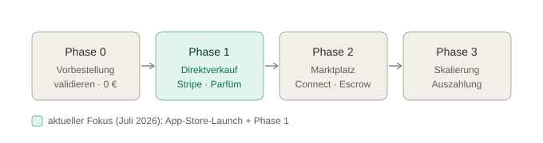
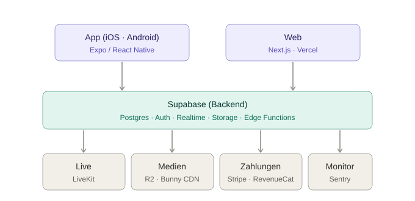
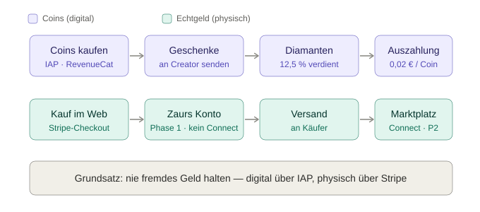
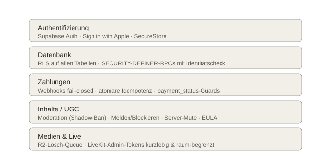
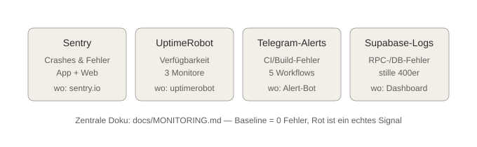
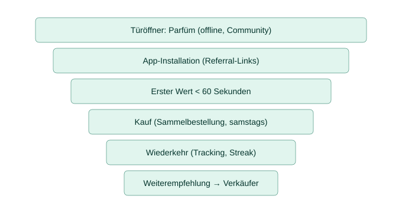
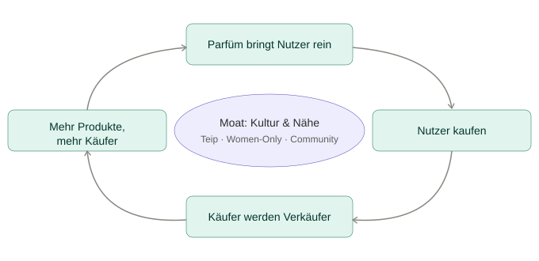

# Serlo — Strategisches Projekt-Briefing

> Team-Onboarding · Aufbau, Finanzen, Technik, Sicherheit, Monitoring, Team, Marketing, Wachstum
> Stand: Juli 2026 · Version 1.30.0 / Build 287
> **PDF-Version:** [`Serlo-Team-Briefing.pdf`](Serlo-Team-Briefing.pdf)

Dieses Dokument gibt einem neuen Teammitglied das vollständige Bild vom Projekt — in der Reihenfolge, in der man es lesen sollte.

---

## 1. Überblick & Vision

`Serlo` (Entwicklungsname Vibes) ist eine TikTok-inspirierte Social-App für iOS/Android und Web, gebaut für die tschetschenische Community und junge Erwachsene. Der Wettbewerbsvorteil ist **nicht** die Technik, sondern **Nähe + Kultur** (Teip, Women-Only, Sprache) — eine App, die sich wie Zuhause anfühlt.

- Status: **Produktion** — Version 1.30.0 / Build 287, gerade bei Apple zur Prüfung.
- Kanäle: App (App Store / TestFlight) und Web (`serlo-web.vercel.app`).
- Geschäftsmodell-Kern: Parfüm-Direktverkauf als Türöffner → Community wächst → Käufer werden selbst Verkäufer → Marktplatz.



---

## 2. Technische Architektur

Ein Backend (`Supabase`) versorgt beide Clients aus **einem** Projekt; externe Spezial-Dienste hängen dran. Wichtig: App-Änderungen gehen oft per **OTA** (`eas update`) ohne neuen Store-Build — nur native Änderungen brauchen einen echten Build.

- Clients: App = `Expo` / React Native (SDK 54, TypeScript); Web = `Next.js` auf `Vercel`.
- Kern: `Supabase` = Postgres + Auth + Realtime + Storage + Edge Functions (Deno).
- Live: `LiveKit` Cloud (WebRTC). Medien: Upload nach `Cloudflare R2`, Video über `Bunny` CDN.
- Zahlungen: `Stripe` (Web/physisch) + `RevenueCat` (App-IAP/Coins). Monitoring: `Sentry`.



---

## 3. Finanz-Architektur

Zwei **strikt getrennte** Geld-Kreisläufe. Grund: Apple verlangt IAP für Digitales, verbietet es aber für physische Ware — und die Plattform soll **nie fremdes Geld halten**.

- **Digital (Coins):** Kauf per IAP → Geschenke an Creator → Diamanten (12,5 % verdient) → Auszahlung 0,02 €/Coin; Plattform behält 50–70 %. In v1 per Feature-Flag versteckt (sauberer Store-Start).
- **Physisch (Echtgeld):** Zahlung im Web per `Stripe`. Phase 1 = Zaurs eigenes Konto (kein Connect); Phase 2 = Marktplatz mit Connect + Escrow.
- Geld-Pfade bereits gehärtet (Webhook fail-closed, atomare Idempotenz, `payment_status`-Guards).



---

## 4. Sicherheit

In Schichten gebaut — jede fängt einen anderen Angriff ab. Regel fürs Team: **keine neue DB-Referenz ohne RLS**, **keine neue Webhook-Function ohne fail-closed-Auth**.



Es gab ein Security-Review der Geld-Pfade (Juli 2026) mit vier Fixes. Offen für Phase 2: `seller_accounts`-RLS enger fassen, Receipt-Verify aktivieren.

---

## 5. Fehler-Überwachung (Monitoring)

Vier Überwachungs-Säulen, zentrale Doku in [`docs/MONITORING.md`](MONITORING.md). Prinzip: **Baseline = 0 Fehler**, jedes Rot ist ein echtes Signal. „Keine Änderung sichtbar" wird zuerst über die Logs geprüft, nicht geraten.



---

## 6. Team — welche Rollen, wie viele Leute

Heute: **1 Person** (Zaur = Gründer + Full-Stack + Business) — das ist der größte Risikofaktor (Bus-Faktor 1). Schlank starten, mit Umsatz wachsen. Die wichtigste frühe Einstellung ist ein **Community- & Moderations-Lead**: bei einer jungen, engen Community ist Vertrauen + Sicherheit das ganze Produkt (und in der EU ist Moderation gesetzliche Pflicht).

| Rolle | Phase 1 (Validierung) | Phase 2 (Wachstum) | Phase 3 (Skalierung) |
|---|:---:|:---:|:---:|
| Gründer / CEO | 1 | 1 | 1 |
| Mobile-Entwicklung (RN/Expo) | 1 | 1–2 | 2 |
| Backend / Web (Supabase, Next) | Zaur | 1 | 2 |
| DevOps / Security | geteilt | 0,5–1 | 1 |
| Product / Design | 0–1 | 1 | 1 |
| **Community & Moderation ★** | 1 | 1–2 | 2–3 |
| Marketing / Growth | 0–1 | 1 | 1–2 |
| Support / Ops | — | 1 | 1–2 |
| Finanz / Recht | extern | extern | 1 + extern |
| **Team-Größe gesamt** | **~3–4** | **~6–8** | **~10–14** |

★ = wichtigste frühe Einstellung. „geteilt/extern" = keine eigene Vollzeitstelle, sondern Nebenrolle oder Dienstleister (Steuerberater, Anwalt).

---

## 7. Marketing-Plan

Kern-Idee (Pre-Mortem): **erst validieren, dann Maschine bauen.** Bei 0 Nutzern bringen plattform-abhängige Einnahmen 0 €. Die einzige heute funktionierende Quelle: Parfüm an selbst reingebrachte Leute verkaufen — halal/alkoholfrei als echter USP.



---

## 8. Wachstums-Plan (Flywheel)

Ein sich selbst verstärkender Kreislauf. Der Marktplatz ist **kein Nachgedanke, sondern der Motor**. In der Mitte sitzt der Burggraben, den kein großer Wettbewerber kopieren kann: **Kultur & Nähe**.



---

## 9. Was noch kritisch ist

- **Recht & Compliance** (größter blinder Fleck): AGB, Widerruf, Impressum, GoBD vor Kundenzahlungen; **UG gründen** (Haftung); DSGVO + Auftragsverarbeitung (Supabase/Stripe/Sentry); **EU Digital Services Act** (Meldewege + Moderation sind Pflicht). Steuerberater + Anwalt **jetzt** extern.
- **Kennzahlen (KPIs):** D1/D7/D30-Retention, DAU/MAU, GMV, Take-Rate, CAC/LTV — dafür fehlt ein sauberes Analytics-Dashboard.
- **Kosten & Runway:** Infra (Supabase, LiveKit, R2, Bunny) skaliert mit der Nutzung; `cost_health_snapshot` existiert, aber Burn-Rate/Break-even braucht einen klaren Blick.
- **Wissen & Bus-Faktor:** fast alles steckt in Zaurs Kopf + `handoff.md`/`CLAUDE.md`/Brain. Fürs Team: Onboarding-Doku, Runbooks (Deploy, Incident, Migrationen), sauberes Secrets-Management.
- **Betrieb & Ausfallsicherheit:** DB-Backups + Wiederherstellungs-Plan, 24/7-Moderationsabdeckung bei Wachstum.

---

## 10. Empfohlene Reihenfolge

1. **Einstellungs-Priorität:** (1) Community- & Moderations-Lead → (2) zweiter Entwickler (entlastet Zaur im Backend/Web) → (3) Marketing/Growth. Recht/Steuer **sofort** extern.
2. **Zuerst validieren:** Erst-Verkauf des Parfüms beweisen (Phase 1), dann Team hochfahren.
3. **Parallel absichern:** UG + Rechtstexte + DSA-Meldewege, bevor Echtgeld über die Plattform fließt.

---

### Regenerieren

Diagramme + PDF neu bauen (nach Text-/Diagramm-Änderungen):

```bash
python3 docs/briefing-assets/build.py
"/Applications/Google Chrome.app/Contents/MacOS/Google Chrome" --headless=new --disable-gpu \
  --no-pdf-header-footer --print-to-pdf="docs/Serlo-Team-Briefing.pdf" \
  "file://$(pwd)/docs/briefing.html"
```
